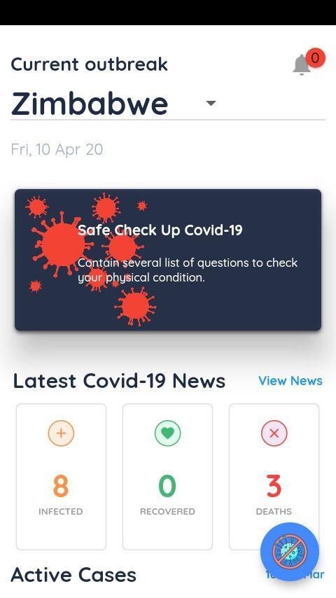
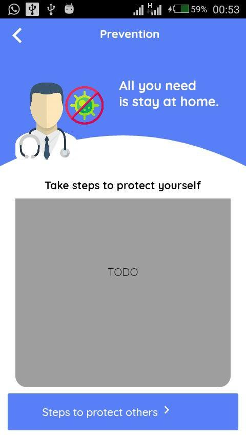

# covid_19_tracker
**CoVID-19 Tracker** was made to spread awareness about the Coronavirus and help users stay up to date.

# Features

* View Latest News
* See Current Cases
* Self Checker

# Screenshots

# Contributions :

Contributions are welcome!

1. Check out our [public issues board][0]. If your issue isn't on the board, [open a new one][1].
2. Fork the project ([Need help forking a project?][3]). You'll do all of your work on your forked copy.
3. Create a branch specific to the issue or feature you are working on. Push your work on that branch ([Need help with branching?][4]).
4. Name the branch something like `fixes-xxx-issue` or `add-xxx-feature` where `xxx` is a short description of the changes or feature you are adding.
5. Once your code is ready, submit a pull request from your branch to CoVID-19 Tracker's `master` branch. I'll do a quick review and give you feedback.

[0]: https://github.com/flutterdevzim/CoVID-19-Tracker/issues
[1]: https://github.com/flutterdevzim/CoVID-19-Tracker/issues/new
[3]: https://help.github.com/articles/fork-a-repo/
[4]: https://github.com/Kunena/Kunena-Forum/wiki/Create-a-new-branch-with-git-and-manage-branches

## Getting Started

This project is a starting point for a Flutter application.

A few resources to get you started if this is your first Flutter project:

- [Lab: Write your first Flutter app](https://flutter.dev/docs/get-started/codelab)
- [Cookbook: Useful Flutter samples](https://flutter.dev/docs/cookbook)

For help getting started with Flutter, view our
[online documentation](https://flutter.dev/docs), which offers tutorials,
samples, guidance on mobile development, and a full API reference.

# License

	MIT License

	Copyright (c) 2020 Flutter Dev Zim

	Permission is hereby granted, free of charge, to any person obtaining a copy
	of this software and associated documentation files (the "Software"), to deal
	in the Software without restriction, including without limitation the rights
	to use, copy, modify, merge, publish, distribute, sublicense, and/or sell
	copies of the Software, and to permit persons to whom the Software is
	furnished to do so, subject to the following conditions:

	The above copyright notice and this permission notice shall be included in all
	copies or substantial portions of the Software.

	THE SOFTWARE IS PROVIDED "AS IS", WITHOUT WARRANTY OF ANY KIND, EXPRESS OR
	IMPLIED, INCLUDING BUT NOT LIMITED TO THE WARRANTIES OF MERCHANTABILITY,
	FITNESS FOR A PARTICULAR PURPOSE AND NONINFRINGEMENT. IN NO EVENT SHALL THE
	AUTHORS OR COPYRIGHT HOLDERS BE LIABLE FOR ANY CLAIM, DAMAGES OR OTHER
	LIABILITY, WHETHER IN AN ACTION OF CONTRACT, TORT OR OTHERWISE, ARISING FROM,
	OUT OF OR IN CONNECTION WITH THE SOFTWARE OR THE USE OR OTHER DEALINGS IN THE
	SOFTWARE.
